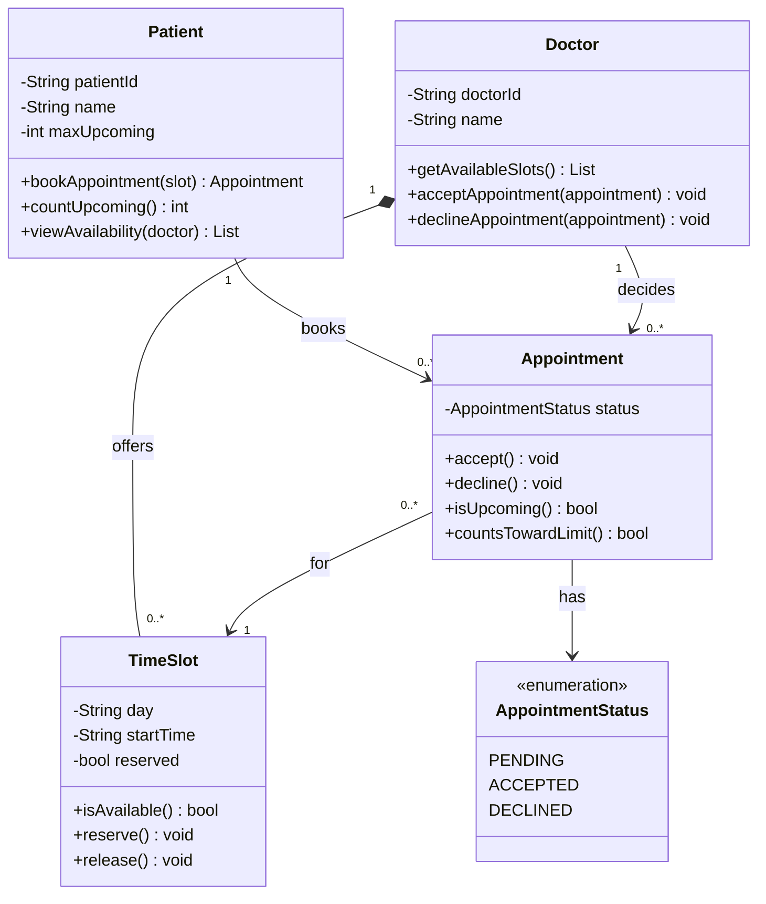

# 4. Class Diagram (P5)

```mermaid
classDiagram
    class Patient {
        -String patientId
        -String name
        -int maxUpcoming
        +bookAppointment(slot) Appointment
        +countUpcoming() int
        +viewAvailability(doctor) List
    }
    class Doctor {
        -String doctorId
        -String name
        +getAvailableSlots() List
        +acceptAppointment(appointment) void
        +declineAppointment(appointment) void
    }
    class TimeSlot {
        -String day
        -String startTime
        -bool reserved
        +isAvailable() bool
        +reserve() void
        +release() void
    }
    class Appointment {
        -AppointmentStatus status
        +accept() void
        +decline() void
        +isUpcoming() bool
        +countsTowardLimit() bool
    }
    class AppointmentStatus {
        <<enumeration>>
        PENDING
        ACCEPTED
        DECLINED
    }
    Patient "1" --> "0..*" Appointment : books
    Doctor "1" *-- "0..*" TimeSlot : offers
    Appointment "0..*" --> "1" TimeSlot : for
    Doctor "1" --> "0..*" Appointment : decides
    Appointment --> AppointmentStatus : has
```