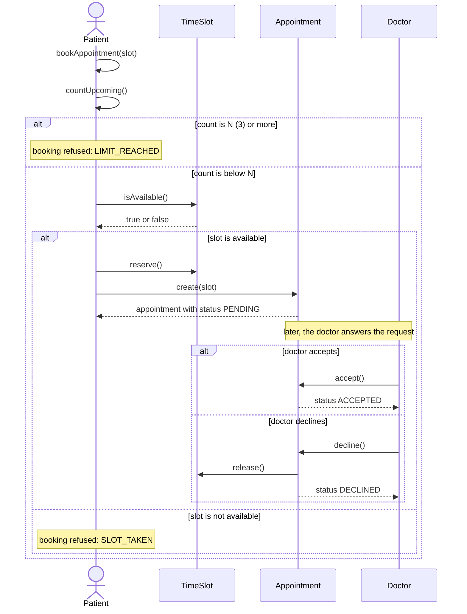

# 5. Sequence Diagram (P6): Book appointment

```mermaid
sequenceDiagram
    actor Patient
    participant TimeSlot
    participant Appointment
    participant Doctor

    Patient->>Patient: bookAppointment(slot)
    Patient->>Patient: countUpcoming()
    alt count is N (3) or more
        Note over Patient: booking refused: LIMIT_REACHED
    else count is below N
        Patient->>TimeSlot: isAvailable()
        TimeSlot-->>Patient: true or false
        alt slot is available
            Patient->>TimeSlot: reserve()
            Patient->>Appointment: create(slot)
            Appointment-->>Patient: appointment with status PENDING
            Note over Doctor,Appointment: later, the doctor answers the request
            alt doctor accepts
                Doctor->>Appointment: accept()
                Appointment-->>Doctor: status ACCEPTED
            else doctor declines
                Doctor->>Appointment: decline()
                Appointment->>TimeSlot: release()
                Appointment-->>Doctor: status DECLINED
            end
        else slot is not available
            Note over Patient: booking refused: SLOT_TAKEN
        end
    end
```